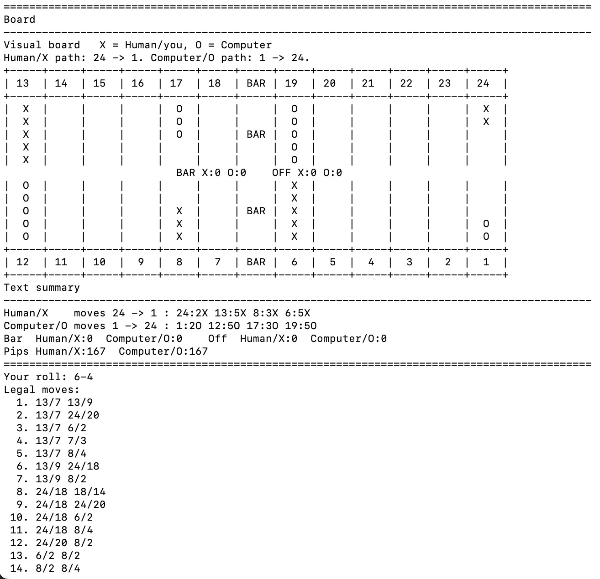

# Text Backgammon with MCTS AI

## Project Overview

This project is a text-based Backgammon game written in Python 3. The human player plays as X, and the computer player plays as O. The project treats Backgammon as a stochastic sequential decision problem because the game happens over a sequence of turns and dice rolls add randomness.

The main decision problem is to choose a legal move sequence after seeing the current board, the current player, and the current dice roll. The computer player does not solve the whole game exactly. Instead, it uses an approximate Monte Carlo Tree Search style method to compare legal moves and choose a move that looks good after simulated future turns.

## Motivation

I chose Backgammon because it is small enough to implement in Python, but it still has real decision-making under uncertainty. The dice make the game different from deterministic games such as chess or tic-tac-toe. A player can see the current board and current dice roll, but future dice rolls are unknown.

This made Backgammon a good project because it has a clear state space, legal actions, state transitions, random outcomes, observations, and a decision method for the computer player.

## Software and Hardware Requirements

The project uses Python 3.

The project runs in a terminal or command prompt.

No external Python packages are required.

The requirements.txt file is included to show that the project only uses the Python 3 standard library.

I tested the project on my Apple MacBook Pro M3.

No GPU or special hardware is required.

## Data Sources

No external dataset was used.

The program uses standard Backgammon rules. Dice rolls are generated randomly by Python. I used the U.S. Backgammon Federation rules page as the main rules reference.

## How to Reproduce the Project

Start from the project root folder.

To run the game:

python -m backgammon_mcts.main

To run the tests:

python -m unittest discover -v

The expected test result is that eight tests pass.

## How to Play

The game starts in the terminal with the human player as X and the computer player as O. During a human turn, the player can type board to redraw the board, legal to show legal moves, or hint to ask the computer AI for a suggested move. The player can choose a move by number from the legal move list or type the move directly. For example, 13/8 6/5 moves two checkers, 13/7* shows a hit, bar/24 enters from the bar, and 6/off bears a checker off the board.

## Example Text Game Board

The game prints a text board in the terminal. X is the human player, and O is the computer player.

Here is an example of the text game board:

The program also prints game information below the board. Human/X moves from point 24 to point 1. Computer/O moves from point 1 to point 24. Bar shows checkers that were hit. Off shows checkers that have finished. Pips show how far each player still needs to move.

## What We Accomplished

The final program creates the standard Backgammon starting board, prints an X/O text board in the terminal, rolls dice, and generates legal move sequences for each turn. It handles hits, checkers on the bar, bearing off, doubles, and turn switching between the human player and the computer player. The human player can choose moves by number or by typed notation, while the computer chooses moves with an approximate Monte Carlo search method. I also added basic unit tests for important game rules and small MCTS self-play checks. The computer AI is set to level 6 in the code, which means it uses 300 simulations and a rollout depth of 6.

## Problem Statement

Backgammon is a two-player board game. Each player has 15 checkers. The goal is to move all checkers around the board, into the home board, and then bear them off before the other player.

In this project, the human player is X and moves from point 24 down to point 1. The computer player is O and moves from point 1 up to point 24.

At the start of a turn, the current board is visible. Dice are rolled. The current player chooses a legal move sequence. The board changes after the move sequence is applied. Then the next player takes a turn.

The stochastic part of the problem is the dice roll. The current dice roll is known before choosing a move, but future dice rolls are unknown. The AI problem is to choose a legal move sequence that is likely to lead to a good future board position.

## Related Solutions

Minimax search is common in deterministic two-player games. It works well when there is no randomness and both players choose moves. Basic minimax is not enough for this project because Backgammon has random dice rolls.

Expectimax search adds chance nodes for random events. This fits dice games better than minimax. However, full expectimax can become expensive because each turn can have many legal move sequences and many possible future dice rolls.

Heuristic search uses a scoring function to estimate how good a board state is. In Backgammon, useful features include pip count, checkers borne off, checkers on the bar, made points, exposed single checkers, and home-board progress.

Q-learning is another possible method. In Q-learning, the program tries to learn a value for each state-action pair. For Backgammon, plain Q-learning would be hard because the state space is very large. There are many possible board positions and dice rolls, so a simple table of Q-values would be too large.

Temporal-difference learning is also related. Tesauro's TD-Gammon is an important Backgammon example. It used self-play and temporal-difference learning to train an evaluation function. This project does not train a neural network or learn weights from many games. Instead, it uses hand-chosen heuristic weights and Monte Carlo rollouts.

Reward learning or value learning could also be used. In that type of approach, the program learns a reward model or value function from data. I did not use that approach because it would require training data or many self-play games. This project focuses on implementing the state space, legal transitions, and a direct approximate decision method.

Monte Carlo rollouts estimate moves by simulating possible futures. This is useful when the future is random. Instead of checking every possible future exactly, the program samples future dice rolls and estimates which move performs well on average.

This project uses a Monte Carlo Tree Search style method with UCB selection at the root. It is approximate, but it is feasible for a large stochastic game.

Tesauro and Galperin used Monte Carlo rollouts for Backgammon policy improvement. They explain that resolving one move by full Monte Carlo sampling may need about 10,000 or more trials per candidate move, or hundreds of thousands of trials for one move decision. Van Lishout, Chaslot, and Uiterwijk tested Monte Carlo Tree Search in Backgammon and used 200,000 random games for opening move tests.

My project uses 300 simulations per computer move at level 6. This is much smaller than the research papers, but it makes the game fast enough to play interactively in a terminal on my Apple MacBook Pro M3.

I also looked at related open-source Backgammon environment code. I did not copy this code. I used it as a reference for how other projects describe Backgammon using state, actions, observations, and transitions. The most relevant related code reference is dellalibera/gym-backgammon, which is an OpenAI Gym style Backgammon environment.

## State Space

The board part of the state is stored in the GameState class.

GameState stores board, bar, and off.

The board is a list of 24 integers. board[i] greater than 0 means point i plus 1 has X checkers. board[i] less than 0 means point i plus 1 has O checkers. board[i] equal to 0 means point i plus 1 is empty.

The bar stores hit checkers. bar[X] is the number of X checkers on the bar. bar[O] is the number of O checkers on the bar.

The off count stores finished checkers. off[X] is the number of X checkers borne off. off[O] is the number of O checkers borne off.

Each player always has 15 checkers total. The number of checkers on the board plus checkers on the bar plus checkers off equals 15.

For one AI decision, the full decision input is state, current_player, and current_roll. The state stores board, bar, and off counts. current_player is either X or O. current_roll is the two dice for the turn.

## Mathematical Description

Let the players be P = {X, O}.

The board state is s = (b, bar_X, bar_O, off_X, off_O).

The board vector is b = (b_1, b_2, ..., b_24).

Each b_i is an integer for one board point. If b_i is positive, point i has X checkers. If b_i is negative, point i has O checkers. If b_i is zero, point i is empty.

The full decision state for one turn is d = (s, p, r). Here p is the current player, and r = (d_1, d_2) is the dice roll. Each die is in {1, 2, 3, 4, 5, 6}.

A terminal state happens when off_X = 15 or off_O = 15. If off_X = 15, the human player wins. If off_O = 15, the computer player wins.

## Actions

An action is a complete legal move sequence for the current dice roll.

A turn can include more than one checker movement because the player may use two dice, or four dice when the roll is a double.

An action is a = (m_1, m_2, ..., m_k).

Each move is m = (source, destination, die, hit, bear_off).

source is the starting point. destination is the ending point. die is the die value used. hit is true if the move hits one opponent checker. bear_off is true if the checker leaves the board.

If source is None, the checker starts from the bar. If destination is None and bear_off is true, the checker is borne off.

The legal actions depend on the board state, the current player, the dice roll, whether the player has checkers on the bar, whether a destination point is blocked, and whether bearing off is allowed.

If no legal move exists, the player passes.

## Transitions

A transition applies an action to a state and produces the next state.

T(s, a) -> s'

For each move in an action, the program removes one checker from the source point or from the bar. If the move hits, the program sends one opponent checker to the bar. If the move bears off, the program adds one checker to the off count. Otherwise, the program places the checker on the destination point.

Once the current state, current action, and current dice roll are known, the board update is deterministic. The randomness is in future dice rolls, not in applying a legal move.

After a turn ends, the next dice roll is sampled randomly. There are 36 ordered dice outcomes if dice order is counted. Doubles are special because the player gets four moves with the same die value.

The program implements transitions with apply_move and apply_sequence in models.py. The AI generates successor states by copying a GameState and then applying one legal move sequence to the copy.

## Observations

This project is fully observable.

Before choosing a move, the player can observe the whole board, both bar counts, both off counts, the current player, and the current dice roll.

The observation for a turn is o = (s, p, r).

This is enough information to generate legal actions and choose a move. Future dice rolls are unknown, but they are random future events rather than hidden current state.

The code does not use a separate Observation class. The observation is represented by the current GameState, current player, and current roll in the game loop. The terminal board display shows the same information to the human player.

## Solution Method

The solution method is an approximate Monte Carlo Tree Search based method. At the start of a computer turn, the dice roll is already known. The AI first calls legal_sequences to generate every legal move sequence for that board, player, and dice roll. Each full legal move sequence is treated as one candidate action at the root of the search. If there is only one legal action, the AI returns it directly. If there are no legal actions, the AI passes.

When there are multiple legal actions, the AI runs a fixed number of simulations. In the project game setting, level 6 uses 300 simulations and rollout depth 6. During each simulation, the AI chooses one root action to try, copies the current GameState, and applies that action to the copied board. This copied board is a successor state. The original board is not changed during simulation, so the AI can safely test many possible actions before choosing one for the real game.

The AI chooses which root action to simulate with a UCB-style score. The UCB score has two parts. The first part is the average reward that an action has received so far. This favors moves that have already done well in earlier simulations. The second part is an exploration bonus. This gives extra value to moves that have not been tried as much. In the code, the score is average_score + c * sqrt(log(total_tries) / action_tries). The value c is 1.4, which is a simple approximation of sqrt(2). The UCB1 idea comes from Auer, Cesa-Bianchi, and Fischer, and the UCT/MCTS idea comes from Kocsis and Szepesvari.

After the root action is applied to the copied state, the AI performs a rollout. A rollout is a short fake future game. Future dice are unknown, so the rollout samples dice with roll_dice. For each sampled turn, the rollout generates legal move sequences and chooses a move with a simple rollout policy. Most of the time, the rollout policy chooses the move with the best heuristic score. A small amount of the time, it chooses a random legal move. This randomness idea comes from Monte Carlo rollout methods, where possible future continuations are sampled instead of calculated exactly. The exact randomness value 0.18 is my project tuning choice, not a paper value.

The rollout stops when there is a winner or when it reaches the rollout depth. If the rollout reaches a real win, the reward is 1 if the root player wins and 0 if the root player loses. If the rollout stops before the game is over, the AI uses a heuristic board score. The heuristic score looks at pip count, checkers borne off, checkers on the bar, made points, blots, and home-board progress. These feature ideas are common in Backgammon evaluators and are related to Berliner and Tesauro, but the exact weights in my code were chosen roughly after a few small local tests.

The raw heuristic score is converted into a reward between 0 and 1 with 0.5 + 0.5 * tanh(score / 80.0). This tanh normalization idea is cited from Tom Keith's Motif Backgammon explanation. The exact divisor 80.0 is also a tuning choice for this project.

After each simulation, the reward is added to the total value for the root action that was tried. The visit count for that action is also increased. After all simulations are finished, the AI computes the average reward for each legal action. It chooses the action with the best average reward. If there is a tie, the code uses visit count and then heuristic score as backup tie-breakers. The final output of choose_move is one legal move sequence, which the game loop then applies to the real GameState.

This is approximately optimal rather than exactly optimal. Exact optimal Backgammon play would require searching a very large game tree with many dice outcomes and many possible move sequences. This project approximates the best decision by sampling future dice rolls and future board states.

## Measuring Success

I measured success in four ways.

First, I checked that the program runs in the terminal and that a human can play against the computer.

Second, I checked that the board prints correctly, dice rolls appear, legal moves are shown, and the computer chooses moves.

Third, I wrote and ran basic unit tests for important rules. The tests check that the initial position is valid, a hit sends an opponent checker to the bar, a checker on the bar must enter before other checkers move, exact dice can bear off, and the opening roll has legal move sequences.

Fourth, I wrote three small fixed-seed MCTS self-play tests. These tests do not prove that the AI is always stronger at higher levels, but they check that the MCTS AI can complete games and that higher settings win in these selected test games.

The MCTS tests check that level 6 with 300 simulations beats level 3 with 120 simulations in one seeded game. They also check that level 8 with 400 simulations beats level 6 with 300 simulations in one seeded game, and that level 8 with 400 simulations beats level 3 with 120 simulations in one seeded game.

The current test result is 8 tests passed.

## Limitations

The interface is text-based, not graphical.

The computer AI is approximate. It does not guarantee the true best Backgammon move.

The tests cover important rules, but they do not cover every possible Backgammon position.

The AI strength depends on the number of simulations, rollout depth, and heuristic weights. More simulations usually improve decisions, but they also make the computer slower.

The project does not implement the doubling cube.

## Conclusion

This project implements Backgammon as a stochastic sequential decision problem. The game state stores the board, bar, and borne-off checkers. The actions are legal move sequences for the current dice roll. The transition model applies those move sequences to create successor states. The observation is the visible board plus the current player and dice roll.

The computer uses an approximate Monte Carlo Tree Search style method to choose moves. This lets the program compute a reasonable decision without solving the full game exactly.

Overall, the project meets the goal of implementing a stochastic game environment and an approximate decision-making method for choosing actions from states and observations.

## References

Auer, Cesa-Bianchi, and Fischer, Finite-time Analysis of the Multiarmed Bandit Problem, 2002:

https://link.springer.com/content/pdf/10.1023/A:1013689704352.pdf

Kocsis and Szepesvari, Bandit Based Monte-Carlo Planning, 2006:

https://doi.org/10.1007/11871842_29

Tesauro and Galperin, On-line Policy Improvement using Monte-Carlo Search, 1996:

https://proceedings.neurips.cc/paper_files/paper/1996/file/996009f2374006606f4c0b0fda878af1-Paper.pdf

Van Lishout, Chaslot, and Uiterwijk, Monte-Carlo Tree Search in Backgammon, 2007:

https://www.researchgate.net/publication/228378473_Monte-Carlo_tree_search_in_backgammon

Tom Keith, How Motif Backgammon Works:

https://bkgm.com/motif/engine.html

Berliner, BKG, a Program That Plays Backgammon:

https://bkgm.com/articles/Berliner/BKG-AProgramThatPlaysBackgammon/

Tesauro, Temporal Difference Learning and TD-Gammon:

https://www.bkgm.com/articles/tesauro/tdl.html

U.S. Backgammon Federation, Backgammon Basics: How To Play:

https://usbgf.org/learn-backgammon/rules-of-backgammon/

dellalibera/gym-backgammon, Backgammon OpenAI Gym:

https://github.com/dellalibera/gym-backgammon

backgammon_engine, BackgammonState and state transitions:

https://docs.rs/backgammon_engine/latest/backgammon_engine/backgammonstate/index.html

Pgx, vectorized reinforcement learning game environments:

https://github.com/sotetsuk/pgx
